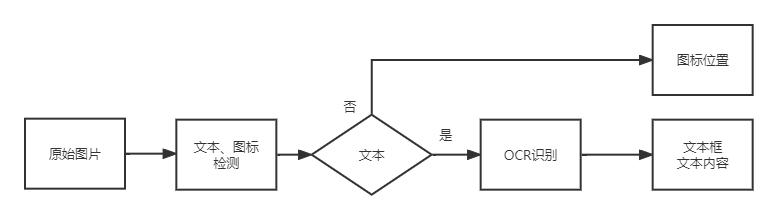

# jinDieRec
这个分支是测试版本，测试新的算法思路。

jindie软件界面元素分析,包括文字和图标，新的思路流程如下：

## 算法思路

1、用目标检测网络出文本和图标集合。

2、对文本框集合调用OCR识别模块做文本内容识别。

3、返回识别后的文本框和图标框集合。

## 版本更新

- 2022.09.24发布 pageitemrec v1.0

  - 检测算法：Robert算子边缘检测，得到二值图
  - 连通域检测，去除大框和横竖长线条，只留下文字和图标
  - 闭运算，合并文字间隙
  - 外轮廓检测，计算轮廓外接矩形
  - OCR识别：使用pprec_v2算法，多线程+onnxruntime推理加速
  - 根据OCR识别置信度，区分是文字还是图标，返回文字和图标集合。

  耗时统计

  | 测试集 | 缩放比例 | 非线程池 |
  | ------ | -------- | -------- |
  | 金蝶   | 1        | 0.186 s  |
  | chrome | 3/4      | 0.391 s  |
