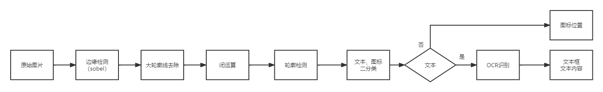

# jinDieRec
这个分支是测试在OCR识别前增加一个分类模型，提前分好 文本和图标，只对文本框做OCR识别。

jindie软件界面元素分析,包括文字和图标，思路流程如下：

## 算法思路

1、对原始图像做灰度化，然后做边缘检测，得到二值图

2、因为直线对文字和图标检测没有帮助且影响较大，所以得先检测并去除掉较长的水平和竖直线。

- 方法1：通过numpy方法统计每行每列中的长度大于阈值的线段。
- 方法2：直接调用opencv的cv2.HoughLinesP算法或cv2.HoughLines算法，检测出所有可能的线段。
- 方法3：检测连通域，将整个框全部去除（可能会将与边框连接的文字全部去除）。

3、去除完直线后，为方便后续做轮廓检测，可以提前做一次闭运算，将长串文字合并，但是也会有风险，将周围距离较近的文字或短线也会被合并，因此这一步看情况选用。

4、做一次外轮廓检测，得到所有的图标和文字轮廓。

5、取每个轮廓的外接矩形，调用图标文本二分类模型，区分出文本和图标集合。

6、对文本框集合调用OCR识别模块做文本内容识别。

7、返回识别后的文本框和图标框集合

## 思考

1、为什么不用OCR直接做检测+识别，而是用传统算法检测？

因为OCR做一次检测耗时200-300毫秒，传统方法反而更快。此外，OCR检测主要检测文字，不一定能检测出图标，而传统算法只关注轮廓， 因此可以将文字和图标都检测出来，可以做到很低的漏检。

## 版本更新

- 2022.09.24发布 pageitemrec v1.0

  - 检测算法：Robert算子边缘检测，得到二值图
  - 连通域检测，去除大框和横竖长线条，只留下文字和图标
  - 闭运算，合并文字间隙
  - 外轮廓检测，计算轮廓外接矩形
  - OCR识别：使用pprec_v2算法，多线程+onnxruntime推理加速
  - 根据OCR识别置信度，区分是文字还是图标，返回文字和图标集合。

  耗时统计

  | 测试集 | 缩放比例 | 非线程池 |
  | ------ | -------- | -------- |
  | 金蝶   | 1        | 0.186 s  |
  | chrome | 3/4      | 0.391 s  |
